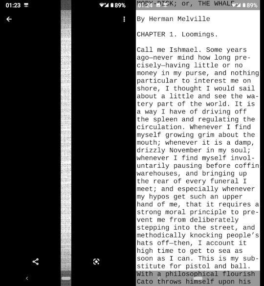

# fmt-hyphen

A text formatter akin to [fmt(1)][] but with hyphenation support. Can
output images as well. Folds long words as a last resort only.

[fmt(1)]: https://manpages.debian.org/unstable/coreutils/fmt.1.en.html

    $ head -200 moby-dick.txt | fmt-hyphen -w30 --image 1.png

produces a long, narrow .png (this is a preview in
com.google.android.apps.photos):

Could be used to share hot takes on twitter w/o using twitter
"threads". Also, I had nothing to do in the last days of 2020.

## Installation

    $ npm i -g fmt-hyphen

Tested on node 15.5.0, f33.

## Usage

~~~
$ head -10 moby-dick.txt | ./fmt-hyphen -w30
MOBY-DICK; or, THE WHALE.

By Herman Melville

CHAPTER 1. Loomings.

Call me Ishmael. Some years
ago—never mind how long pre‐
cisely—having little or no
money in my purse, and nothing
particular to interest me on
shore, I thought I would sail
about a little and see the wa‐
tery part of the world. It is
a way I have of driving off
the spleen and
~~~

Print supported language patterns (`-l` option to select):

~~~
$ ./fmt-hyphen --lang-list | column
be              en-us           hy              nl              sv
bn              es              it              or              ta
ca              fi              kn              pa              te
cs              fr              la              pl              tr
da              grc             lt              pt              uk
de              gu              lv              ru
el-monoton      hi              ml              sk
el-polyton      hu              nb-no           sl
~~~

## License

MIT
